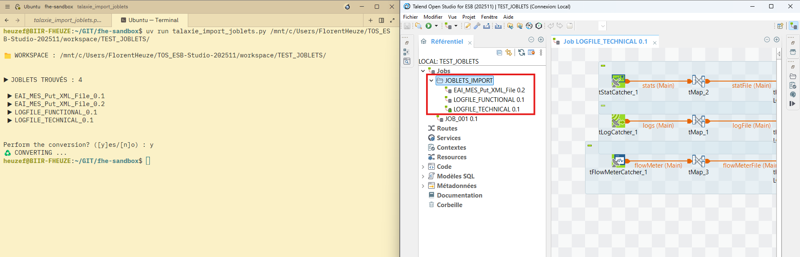

# TALAXIE IMPORT JOBLETS

Import Joblets into Talaxie.



## Requirements
Install Python and requirements with PIP :

```
pip install -r requirements.txt
```

## How to use

Simply run the script with WORKSPACE path :

```
python talaxie_import_joblets.py <PATH_TO_WORKSPACE>
```
